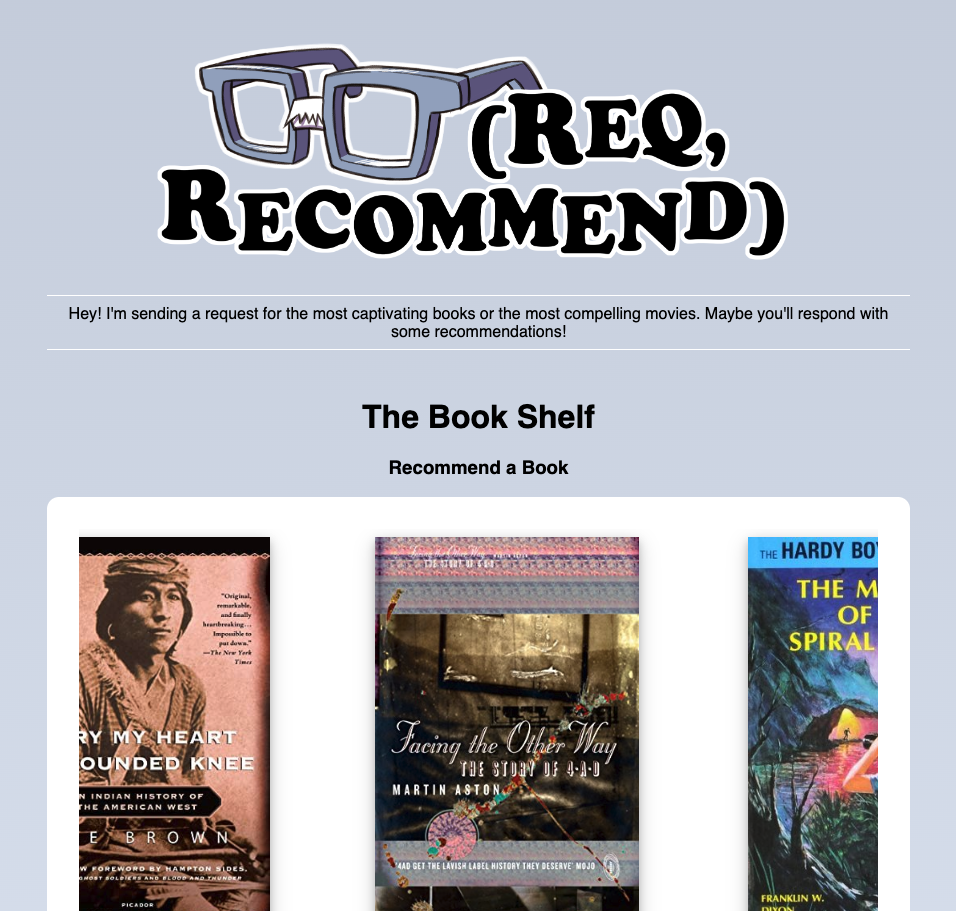
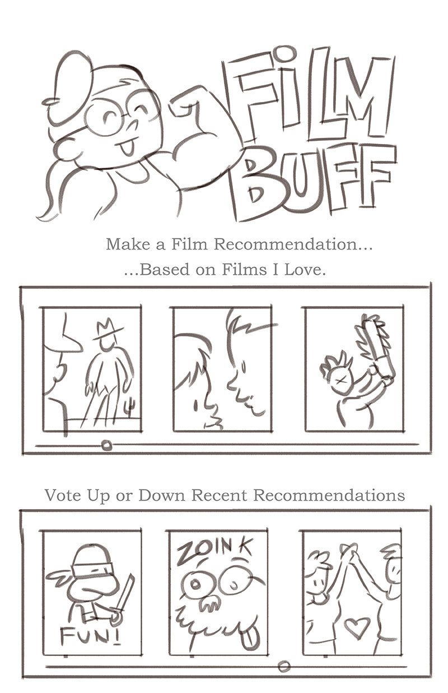
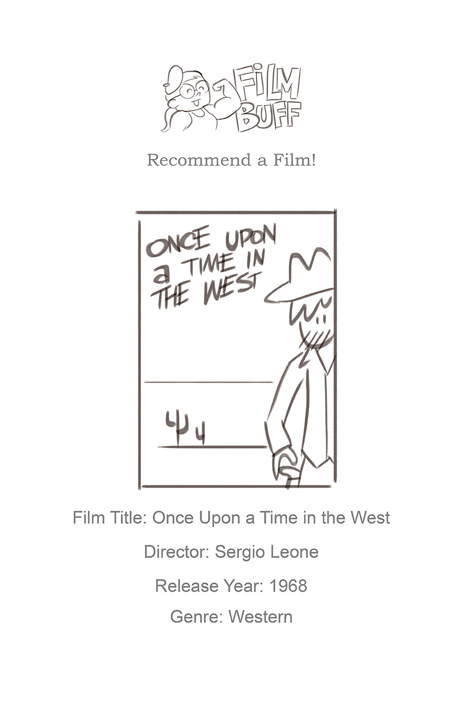
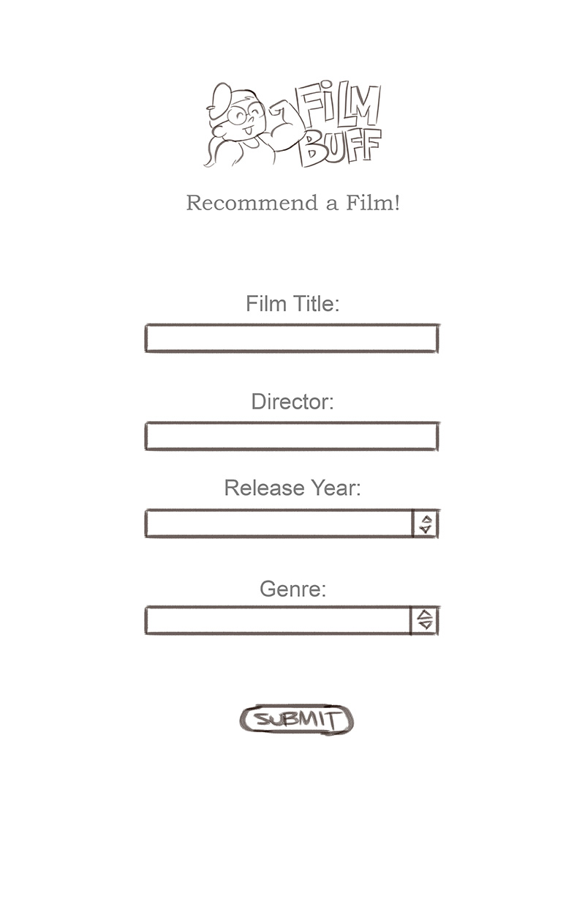

# ga_project_02
<h1>Link to my hosted, working app.</h1>
<a href="gaproject02-production.up.railway.app">Req, Recommend</a>

<h1>An embedded screenshot of the app</h1>

 <h1>List of the Technologies used</h1>
 <ul>
  <li>HTML</li>
  <li>CSS</li>
  <li>JavaScript</li>
  <li>A working, full-stack application using Node.js, Mongoose, Express and EJS</li>
  <li>2 Models, both with 7 RESTful routes and full CRUD</li>
 </ul>
 
 <h1>Installation instructions</h1>
 No istallation required.
 
 <h1>User stories – who are your users, what do they want and why?</h1>
 <ul>
  <li>As a lover of books and/or film, I want to discover new books and/or films through recommendations from my esteemed peers who are also using this app.</li>
  <li>As a hipster...ahem...literature and film connoisseur, I want to show off my knowledge by making obscure recommendations that users of this app have probably never heard of...because I'm so cool.</li>
  <li>As an internet troll, I want to delete all of the entries in this app's database and replace them with completely random (and hopefully offensive) suggestions of my own.</li>
 </ul>
 
 <h1>Your Wireframes – sketches of major views / interfaces in your application</h1>
 
 
 
 
 <h1>Descriptions of any Unsolved problems or major hurdles you had to overcome</h1>
 
 The book and movie "shelves" expand too far when books/movies with longer titles are entered.  I was unable to figure out how to use the ellipsis because the width of the div was not static (which appears to be required for css to use ellipsis).  The dynamic width was determmined by the images above the titles.

